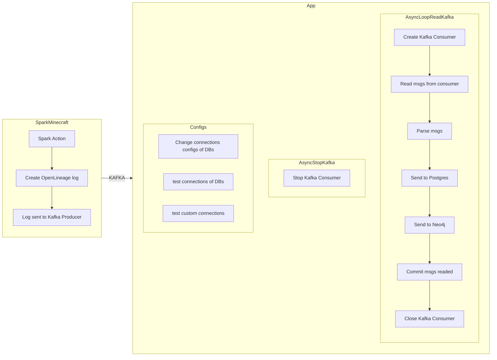
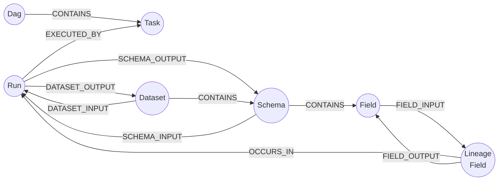

## Getting started

Subir uma instance local do kafka, postgres e neo4j
```bash
docker compose -f docker-compose-kafka.yml up
docker compose -f docker-docker-compose-postgres-neo4j.yml up
```
Criar um ambiente conda
```bash
conda create -n project python=3.8 -y
conda activate project
make install
```
Rodar aplicação
```bash
make run_app
```
Swagger UI
```sh
http://localhost:8086/docs#/
```

## curl api endpoints

### GET commands

Basic Authentication
Exemplo:
base64('user:pass') = dXNlcjpwYXNz
base64('admin:1234') = dXNlcjpwYXNz


Inicia/reinicia o loop assíncrono do kafka comsumer, necessário após subir a aplicação, pois o padrão é desligado
```bash
curl -i -H "Accept: application/json" -H "Content-Type: application/json" -H "Authorization: Basic dXNlcjpwYXNz" -X GET http://localhost:8086/kafka/restart
```

Interrompe o loop kafka comsumer
```bash
curl -i -H "Accept: application/json" -H "Content-Type: application/json" -H "Authorization: Basic dXNlcjpwYXNz" -X GET http://localhost:8086/kafka/stop
```

Interrompe o processo que envia os dados para o neo4j
```bash
curl -i -H "Accept: application/json" -H "Content-Type: application/json" -H "Authorization: Basic dXNlcjpwYXNz" -X GET http://localhost:8086/neo4j/off
```

Reinicia o processo que envia os dados para o neo4j, o processo pode ser parado sem ter perda de dado, pois o neo4j recebe os dados direto do postgres

```bash
curl -i -H "Accept: application/json" -H "Content-Type: application/json" -H "Authorization: Basic dXNlcjpwYXNz" -X GET http://localhost:8086/neo4j/on
```

Testa se as configurações atuais de conexões do postgres, neo4j e kafka estão ok
```bash
curl -i -H "Accept: application/json" -H "Content-Type: application/json" -H "Authorization: Basic dXNlcjpwYXNz" -X GET http://localhost:8086/test_cons_configured
```
### POST commands

Teste conexões de configurações customizadas, recomendado antes de trocar por novas configurações
```bash
# postgres
curl -X POST http://localhost:8086/test_custom_connection -H 'Content-Type: application/json' -H "Authorization: Basic dXNlcjpwYXNz" -d '{"type_conn": "postgres","host": "localhost","port": "5432","usr": "openlineage","pwd": "openlineage","db": "openlineage"}'

# kafka
curl -X POST http://localhost:8086/test_custom_connection -H 'Content-Type: application/json' -H "Authorization: Basic dXNlcjpwYXNz" -d '{"type_conn": "kafka","host": "localhost","port": "9092", "topic":"nome_topico"}'

# neo4j
curl -X POST http://localhost:8086/test_custom_connection -H 'Content-Type: application/json' -H "Authorization: Basic dXNlcjpwYXNz" -d '{"type_conn": "neo4j","host": "localhost","port": "7687","usr": "neo4j","pwd": "openlineage"}'
```

Trocar configurações de conexões
```bash
# postgres
curl -X POST http://localhost:8086/change_conn_config -H 'Content-Type: application/json' -H "Authorization: Basic dXNlcjpwYXNz" -d '{"type_conn": "postgres","host": "localhost","port": "5432","usr": "openlineage","pwd": "openlineage","db": "openlineage"}'

# kafka
curl -X POST http://localhost:8086/change_conn_config -H 'Content-Type: application/json' -H "Authorization: Basic dXNlcjpwYXNz" -d '{"type_conn": "kafka","host": "localhost","port": "9092"}'

# neo4j
curl -X POST http://localhost:8086/change_conn_config -H 'Content-Type: application/json' -H "Authorization: Basic dXNlcjpwYXNz" -d '{"type_conn": "neo4j","host": "localhost","port": "7687","usr": "neo4j","pwd": "openlineage"}'
```

Adcionar novos usuários
```bash
curl -X POST http://localhost:8086/add_new_user -H 'Content-Type: application/json' -H "Authorization: Basic dXNlcjpwYXNz" -d '{"user": "harley","pwd": "ivy", "role": "default"}'
```

## Desenho do processo


## Modelo relacional

<p align="center" width="100%">
    
</p>

## Modelo de grafo

